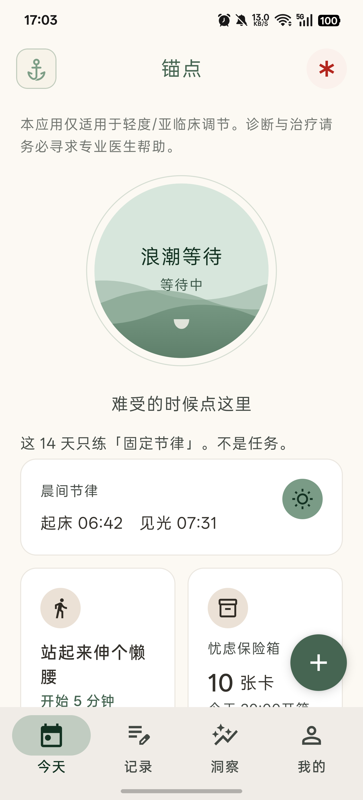
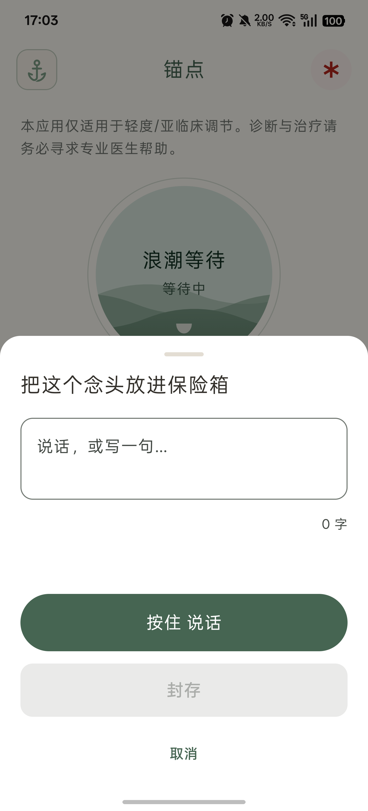
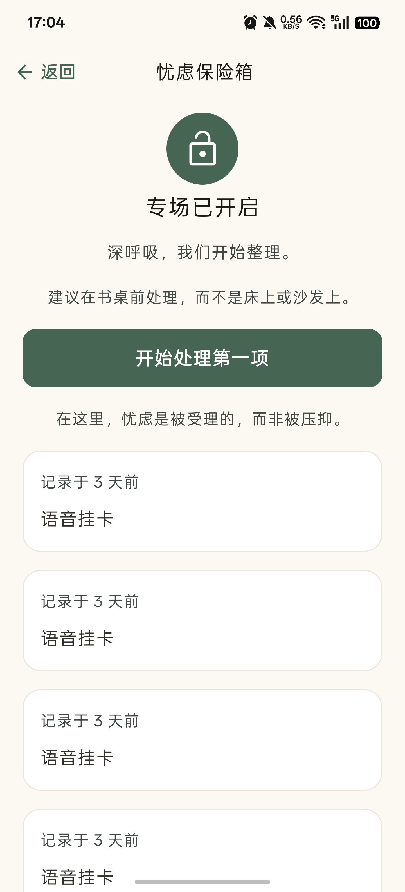
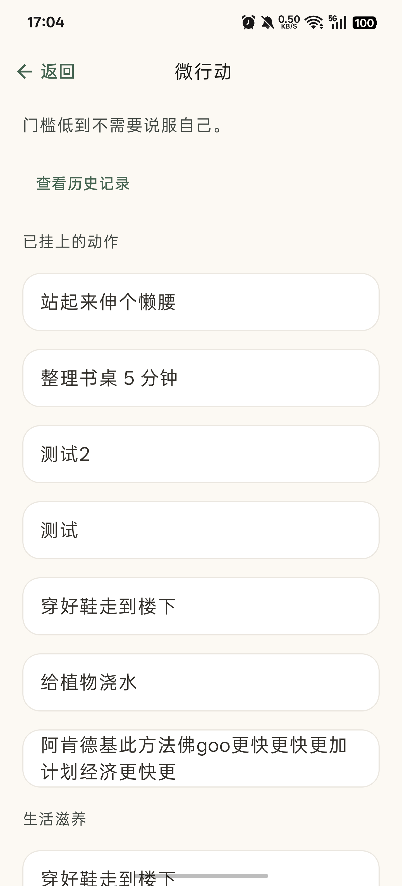
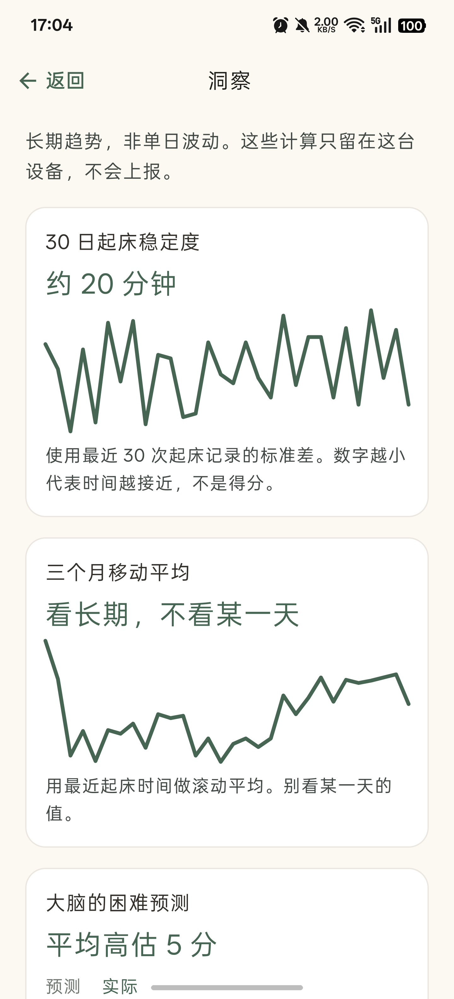
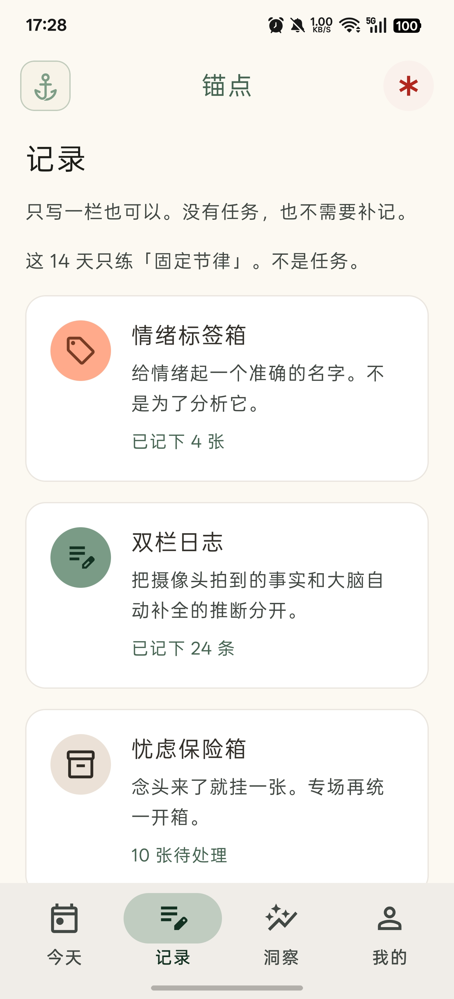

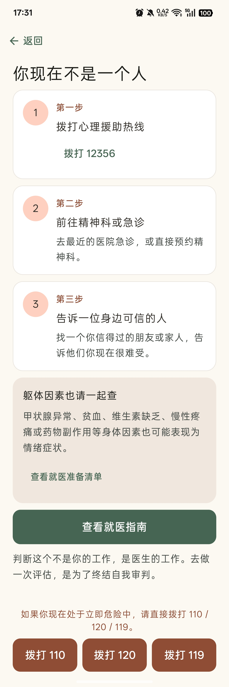

<div align="center">

# 锚点 Anchor

**一款不讲鸡汤、不强求「积极想开」的微行为辅助应用。**

面向亚临床情绪波动与内耗：用极简动作和事实记录改变输入，而不是说服自己。

当前版本 `0.1.3` · Kotlin Multiplatform · Android 首发

</div>

> **医疗声明**：本应用**不是**医疗诊断或治疗工具。出现中重度症状、自伤或轻生念头时，应寻求专业医疗帮助。首启 PHQ-9 / GAD-7 达中重度，或 PHQ-9 第 9 题 > 0 分时，应用会进入危机引导或就医等待期，并主动暂停练习类功能。

---

## 为什么是锚点

市面上大多数情绪应用在教你「想开点」。锚点反其道而行，基于三个朴素的设计决定：

**改变输入，而不是说服自己。** 情绪不是被道理说服的，是被微小的行为和事实慢慢挪动的。锚点里的每个练习都很小——给情绪起个准确的名字、把事实和推断分栏写下来、做一个五分钟的小动作、等十分钟的浪。小到不需要说服自己就可以开始。

**没有羞耻机制。** 没有连续打卡、没有完成率、没有补卡、没有「好久没来了」。断档不警告，失败不统计，洞察页只呈现客观计数（分钟、次数、张数），永不出现百分比和 KPI。放弃一天和坚持一天，应用对你的态度完全一样。

**数据只属于你。** 没有账号、后端、云同步、埋点或广告 SDK。记录在本机用 SQLCipher 加密存储，锁屏通知只显示「锚点」二字。换机靠你自己生成的加密备份（AES-GCM，密码不保存在应用里）。开发者打不开你的手机，也不存在一个可以调取你记录的服务器。

设计决策详见 [ADR-0001 本地优先](docs/adr/0001-local-only-no-account.md) 与 [ADR-0003 反 KPI](docs/adr/0003-anti-kpi-metrics.md)。

## 功能导览

| | |
| --- | --- |
|  |  |
| **今天**：一次只练一件事，14 天锁定不铺开 | **挂卡**：念头来了速记封存，支持按住说话离线转文字 |
|  |  |
| **忧虑保险箱**：白天封存，20:00 专场统一开箱处理 | **微行动**：预测难度 → 5 分钟 → 实际体感，翻看历史证据 |
|  |  |
| **洞察**：本地现算的长期趋势，不是得分 | **记录**：情绪、双栏日志、忧虑的统一入口 |
|  |  |
| **数据管理**：加密导出 / 恢复 / 彻底删除，全部手动 | **此刻需要帮助**：三步热线与就医指引，立即危险一键拨打 |

完整模块一览：

| 模块 | 做什么 |
| --- | --- |
| 浪潮等待 | 难受时：承认 → 定位身体受压处 → 等 10 分钟，不对抗 |
| 情绪标签箱 | 从具体词库起名，写成一句可看见的对象 |
| 双栏日志 | 左栏摄像头事实，右栏大脑推断；只写一栏也可以 |
| 忧虑保险箱 / 挂卡 | 白天速记封存，默认 20:00–20:20 专场开箱处理 |
| 微行动 | 5 分钟低门槛动作，记下预测 vs 实际；可翻「历史证据」 |
| 起床 · 见光 | 两个独立记录点，洞察里看稳定度（分钟），不是得分 |
| 关系与利他 | 表演耗竭盘点、回血/抽干账本、默认非社交的微小利他 |
| 语音速记 | 按住说话离线转文字：端侧识别四级兜底（平台 → 流式 Zipformer → ncnn → 纯录音），全程不联网 |
| 就医与帮助 | 地区化热线与就诊准备；大陆 / 港 / 澳 / 台 / 美 / 英 / 日 |

底部四个入口：**今天、记录、洞察、我的**。

## 安全设计

心理类应用的信任从安全边界开始：

- **首启评估**：PHQ-9 + GAD-7 双量表（版权 Pfizer，仅筛查参考，不是诊断）。
- **危机引导**：量表第 9 题（自伤相关）> 0 分立即进入危机说明，地区化热线号码交给系统拨号盘。
- **就医等待期**：中重度分档自动暂停全部练习入口——这不是惩罚，就医指南、躯体清单和仅记录的双栏日志保持可用，解除需连续两次（间隔 ≥7 天）回落轻度。
- **温和提醒**：全部四类提醒（忧虑专场、危机后关怀、复评邀请、就医等待期关怀）默认可关闭，关掉不挽留。

## 隐私承诺

| 承诺 | 实现 |
| --- | --- |
| 记录不出设备 | SQLCipher 加密 + Keystore 包裹随机密钥；无网络权限（商店版） |
| 通知不泄密 | 锁屏只显示「锚点」，正文仅在解锁后可见 |
| 导出密码不落盘 | PBKDF2 + AES-GCM；密码当场输入、用后即清，遗失无法恢复 |
| 识别不离线不降级 | 端侧语音识别；无可用模型时回落纯录音，绝不转在线识别 |
| 无追踪 | 无崩溃上报、无分析 SDK、无广告；`scripts/verify_privacy.py` 作为机械门禁 |

完整政策见 [anchor-legal.125457.xyz/privacy](https://anchor-legal.125457.xyz/privacy)（应用内可离线阅读全文）。

## 获取与安装

目前处于内部测试阶段：

- **内部测试包**（推荐）：从 [Releases](https://github.com/IAmKings/Anchor/releases) 下载 `anchor-internal-*.apk`（标准渠道）或 `anchor-internal-play-*.apk`（Play 渠道）。固定签名，可检查更新。构建流程见 [ADR-0004](docs/adr/0004-internal-github-release.md)。
- **自行构建**：`./gradlew :androidApp:assembleStandardDebug`，Debug 包不联网。
- 已装 Debug 包换装测试包需先加密导出再卸载（签名不同）。

## 开发者指南

**技术栈**：Kotlin · Compose Multiplatform（共享 UI 在 `shared/`）· SQLDelight + SQLCipher · AlarmManager 计时与提醒 · sherpa-onnx 端侧语音（可选下载，162MB + 标点 76MB）。

```
shared/          共享领域、存储、Compose 页面与测试（135 个单测）
androidApp/      Android 宿主、权限、计时、导出分享、语音引擎
iosApp/          SwiftUI 壳（真机验证以 Android 为主）
design/          Stitch 设计稿（实现对照）
docs/            可行性、ADR、调研、QA 脚本
```

```bash
make verify                              # 隐私门禁 + PRD 结构校验
./gradlew :shared:testDebugUnitTest      # 共享模块单元测试
./gradlew :androidApp:assembleStandardDebug && adb install -r androidApp/build/outputs/apk/standard/debug/androidApp-standard-debug.apk
```

环境：JDK 11+、Android SDK（compileSdk / targetSdk 36、minSdk 26）。依赖镜像在 `settings.gradle.kts` 配置。

**质量基线**：17 页人工走查全过（[docs/QA_17_PAGES.md](docs/QA_17_PAGES.md)）；深浅色、200% 字体、TalkBack 无障碍抽查完成；编码规范见 [.trellis/spec/](.trellis/spec/)（含隐私红线与 Compose UI 规则）。

## 文档索引

| 文件 | 内容 |
| --- | --- |
| [PRD.md](PRD.md) | 需求、安全边界、地区热线表 |
| [CONTEXT.md](CONTEXT.md) | 产品用语与禁用说法 |
| [IMPLEMENTATION_PLAN.md](IMPLEMENTATION_PLAN.md) | 实施基线与切片记录 |
| [DESIGN.md](DESIGN.md) / [design/](design/) | 视觉与页面稿 |
| [docs/QA_17_PAGES.md](docs/QA_17_PAGES.md) | 17 页人工验收勾选脚本 |
| [docs/adr/](docs/adr/) | 架构决策记录 |

## 当前范围外

- 医生视角 PDF 报告（导出为加密 JSON + CSV）
- 第 5 类晨间节律系统提醒
- 锁屏通知插画素材
- iOS 真机作为首发阻塞验证

## 许可与医疗声明

本仓库尚未声明开源许可证。应用内量表（PHQ-9 / GAD-7）与危机热线号码以 PRD 及发布前复核为准；号码可能变更，产品不做在线校验。
